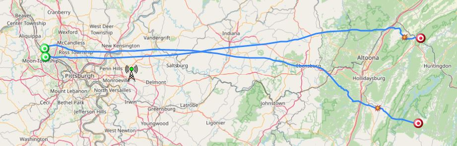

# Raspberry Pi RTL-SDR Automatic Radiosonde Receiver Image  

This image was developed to create an automatic radiosonde receiver station on a Raspberry Pi using a RTL-SDR dongle. 
Once installed and set up properly, it will run the [radiosonde_auto_rx](https://github.com/projecthorus/radiosonde_auto_rx/wiki) software in unattended mode and transmit data packets to the [SondeHub Radiosonde Tracker](https://tracker.sondehub.org) web site.  
In addition, a [web interface](https://github.com/projecthorus/radiosonde_auto_rx/wiki/Web-Interface-Guide) is available over the local network that provides a way of seeing the live status of your station, and also a means of reviewing and analyzing previous radiosonde flights. Collected meteorological data can be plotted in the common 'Skew-T' format. 

## 1. Quick Start Guide
Note that some knowledge of Linux and Raspberry Pi is assumed.

### 1.1 Hardware Needed
- [Raspberry Pi 3/4](https://www.raspberrypi.com/) with power supply
- [RTL-SDR dongle](https://www.rtl-sdr.com/rtl-sdr-quick-start-guide)
- [Serial console cable](https://www.adafruit.com/product/954) for configuring the Raspberry Pi
- Micro SD card in the range 8GB - 64GB
- Antenna suitable for the 400-406 MHz frequency range

### 1.2 Software Needed
- The pre-built RTL-SDR Automatic Radiosonde Receiver Image located here: (TBD)

### 1.3 Configuration Information Needed
You will need the following information to customize your station:
- Your wireless network name and password
- Your station callsign (or other identifier) to display
- Your station latitude in decimal degres (e.g., 30.70178)
- Your station longitude in decimal degrees (e.g., -83.94209)
- Your station (or antenna) altitude in meters (e.g., 285.0)
- An e-mail address where the SondeHub website admins can reach you

Raspberry Pi login information:
- Hostname: `rpi-sdr`
- Username: `rpi`
- Password: `12345678`

### 1.4 Installation and Setup
1. Install the pre-built image on a micro SD card using [Raspberry Pi Imager](https://www.raspberrypi.com/news/raspberry-pi-imager-imaging-utility) or a similar tool. SD card minimum size is 8 GB for this image.  
2. Boot the Raspberry Pi using the card.  This will take some time while the file system expands to the size of the SD card.
3. Connect the serial console cable to the Pi and open a terminal window on a PC and log in using the above username and password. 
   On the Pi's 40-pin header:
   - Pin 6 = Ground
   - Pin 8 = Pi TxD (connect to serial console cable RxD)
   - Pin 10 = Pi RxD (connect to serial console cable TxD)
4. *NOTE:* Perform this step *BEFORE* connecting the Raspberry Pi to a network.  This will keep incorrect data off the sondehub tracker website.
   Edit the common `my_station.txt` file and run a Python script to update the configuration files:  
   * `$ nano my_station_text`  
   * Modify the entries in the text file with your custom station configuration info, then save and exit  
   * `$ python config_my_station.py`  
5. Set up your wireless network using `sudo raspi-config`
6. Connect the RTL-SDR dongle and antenna and reboot the Raspberry Pi. It will automatically start radiosonde_auto_rx and begin searching for radiosondes.

### 1.5 Automatic Radiosonde Receiver Operation
Upon boot, the radiosonde_auto_rx application is started automatically. No user intervention is needed.  
It will scan the 400 - 406 MHz frequency range for radiosonde signals. When a signal is found, it will decode packets on that frequency.  When no packets are detected for 3 minutes, scanning will resume.  Packets will be sent to the SondeHub Tracker website at regular intervals.  

A web interface that displays a sonde position map and decoded packets is available on port 5000 on the local network. From another computer, enter one of the following URLs in a browser:
- http://rpi-sdr.local:5000/
- http://XYZ:5000/ (replace XYZ with the Raspberry Pi's IP address)  

## 2. Pre-Built Image Details

### 2.1 Packages provided with this image  

#### 2.1.1 Linux  
This image was built from `Linux 5.15.84-v8+ #1613 SMP PREEMPT Thu Jan 5 12:03:08 GMT 2023`

#### 2.1.2 radiosonde_auto_rx  
This application provides automatic reception and uploading of Radiosonde positions to multiple services, including:  
  - The SondeHub Radiosonde Tracker - a tracking website specifically designed for tracking radiosondes  
  - ChaseMapper for mobile radiosonde chasing  

Auto-RX's Web Interface provides a way of seeing the live status of your station, and also a means of reviewing and analysing previous radiosonde flights. Collected meteorological data can be plotted in the common 'Skew-T' format. 

The auto_rx configuration file is located on the Raspberry Pi image at `~/radiosonde_auto_rx/auto_rx/station.cfg`

Information on radiosonde_auto_rx can be found here:  
https://github.com/projecthorus/radiosonde_auto_rx

### 2.2 Additional packages provided (not needed for the automatic radiosonde receiver)

#### 2.2.1 Chasemapper  
This is a companion application to radiosonde_auto_rx.  It is a mapping system designed specifically for chasing high-altitude weather balloons, be it those you might launch yourself, or those launched by your local weather bureau.  

Note that this application is not needed to use your Raspberry Pi as an unattended radiosonde receiver. The reason for providing it is so a single Raspberry Pi could be configured as either a stationary receiver or incorporated into a chase vehicle.  

This is still a work in progress. Configuration is not complete and must be done by the user.  The Chasemapper configuration file is located on the Raspberry Pi image at `~/chasemapper/horusmapper.cfg`  

Information on Chasemapper can be found here:  
https://github.com/projecthorus/chasemapper

#### 2.2.2 LTE-Cell-Scanner  
This application can be used to provide PPM correction for radiosonde_auto_rx.  

If you have LTE cell towers in range, you can use the pre-built `CellSearch` program to determine the PPM offset of your RTL-SDR dongle, and add this correction to the radiosonde_auto_rx configuration file.  

You will need to find a map of cell towers in your area and their downlink frequencies, and then follow the instructions in Section 4 ("Running") of the following website: 
https://gist.github.com/darksidelemm/b517e6a9b821c50c170f1b9b7d65b824

For example, I have a 739 MHz (downlink) tower near me, so I would run the following:  
`$ CellSearch --freq-start 739e6 --freq-end 739e6`  
and then follow the instructions in the above link to determine the PPM correction.  The correction value can be added to the radiosonde_auto_rx configuration file.

Note that cell phone bands in the 600 - 850 MHz range will work, but bands in the 1700 - 2100 MHz range are outside the frequency range of the RTL-SDR.

#### 2.2.3 SPY Server  
The RTL-SDR dongle can be used as a high performance SDR receiver capable of streaming separate chunks of the spectrum to multiple clients over the LAN or the Internet. SPY Server is an SDR server that can be used by SDR# ("SDR-Sharp") over a network on port 5555.  When SPY Server is running on this machine, SDR# clients can connect to it over the local network using this machine's IP address or host name, for example:  
  - sdr://rpi-sdr.local:5555  
  - sdr://XYZ:5555  (replace XYZ with the Raspberry Pi's IP address)  

Information on SPY Server and SDR# can be found on the Airspy website:  
https://airspy.com

Information on setting up SPY Server with RTL-SDR on the Raspberry Pi can be found here:  
https://www.rtl-sdr.com/rtl-sdr-tutorial-setting-up-and-using-the-spyserver-remote-streaming-server-with-an-rtl-sdr

The SPY Server configuration file is located on the Raspberry Pi image at `~/spyserver/spyserver.config`

### 2.3 Running Other SDR Applications
Note that all of the applications described above are mutually exclusive - only one can be run at a time.

To use other SDR operations, the radiosonde_auto_rx application must first be stopped:  
`$ sudo ./stop_auto_rx.sh`  
Note that it will restart automatically upon the next boot.  To restart it without rebooting:  
`$ sudo ./start_auto_rx.sh`

#### 2.3.1 SPY Server
1. Stop radiosonde_auto_rx if it is running. 
2. Start SPY Server: `$ ./start_spyserver.sh`
3. Stop SPY Server: `$ ./stop_spyserver.sh`

SPY Server will not automatically restart upon reboot.

#### 2.3.2 Chasemapper
1. Stop radiosonde_auto_rx if it is running.
2. Start Chasemapper: `$ ./start_chasemapper.sh`
3. Stop Chasemapper: `$ ./stop_chasemapper.sh`

Note that this is still a work in progress and Chasemapper is not fully configured.

## 3. References and Additional Links

The pre-built Raspberry Pi image was created by Tom Kerr AB3GY (ab3gy@arrl.net)

The SondeHub Tracker website and radiosonde_auto_rx and Chasemapper applications are provided by the Amateur Radio Experimenters Group and were developed as part of Project Horus.  
See this website for details:  
https://www.areg.org.au/archives/category/activities/project-horus

LTE-Cell-Scanner is provided by Mark Jessop VK5QI  
See: https://gist.github.com/darksidelemm  
See also: https://rfhead.net  

SPY Server is provided by Airspy.  
See: https://airspy.com

## 4. Licensing Information
All software on the pre-built Raspberry Pi image is licensed by their individual copyright holders.  See the Raspberry Pi and each application website for details.  No additional licensing is asserted here.
