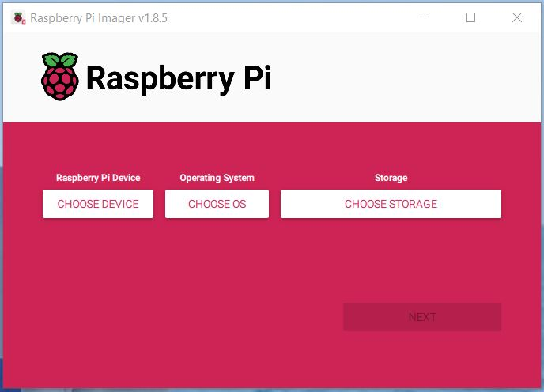
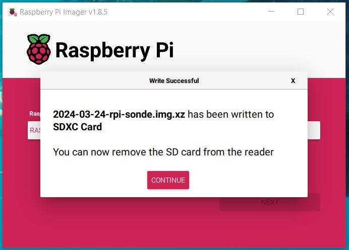

# Raspberry Pi RTL-SDR Automatic Radiosonde Receiver Image  

This operating system image was developed to create an automatic radiosonde receiver station on a [Raspberry Pi](https://www.raspberrypi.com/) using a [RTL-SDR dongle](https://www.rtl-sdr.com/rtl-sdr-quick-start-guide).  
Once installed and set up properly, it will run [radiosonde_auto_rx](https://github.com/projecthorus/radiosonde_auto_rx/wiki) software in unattended mode and transmit data packets to the [SondeHub Radiosonde Tracker](https://tracker.sondehub.org) web site.  

In addition, a [web interface](https://github.com/projecthorus/radiosonde_auto_rx/wiki/Web-Interface-Guide) is available over the local network that provides a way of seeing the live status of your station, and also a means of reviewing and analyzing previous radiosonde flights. Collected meteorological data can be plotted in the common 'Skew-T' format. 

All setup and configuration can be done from a Windows PC.  You don't need to log in to the Raspberry Pi or compile any code for the initial setup.  
See the Quick Start Guide in Section 1 below to get your station up and running.  
See Section 2 if you want do dive a litte deeper into the details.  

## Changelog  
#### 2023-03-24
- Pre-built image: `2024-03-24-rpi-sonde.img.xz` 
  -- Includes RTL-SDR V4 driver  
  -- Supports Radiosonde Auto-RX 1.7.2  
- Instructions support Raspberry Pi Imager v1.8.5  

## Table of Contents
1.    [Quick Start Guide](#quick-start-guide)  
1.1   [Hardware Needed](#hardware-needed)  
1.2   [Software Needed](#software-needed)  
1.3   [Configuration Information Needed](#config-info-needed)  
1.4   [Raspberry Pi Imager](#raspberry-pi-imager)  
1.5   [Install the Pre-Built Image on the SD Card](#install-image)  
1.6   [Station Customization](#station-customization)  
1.7   [Hardware Setup](#hardware-setup)  
1.8   [Automatic Radiosonde Receiver Operation](#automatic-operation)  
2.    [Pre-Built Image Details](#pre-built-image-details)  
2.1   [Packages provided with this image](#packages-provided)  
2.1.1 [Linux](#linux)  
2.1.2 [radiosonde_auto_rx](#radiosonde-auto-rx)  
2.2   [Additional packages provided](#additional-packages)  
2.2.1 [Chasemapper](#chasemapper)  
2.2.2 [LTE-Cell-Scanner](#lte-cell-scanner)  
2.2.3 [SPY Server](#spyserver)  
2.3   [Running Other SDR Applications](#running-other-applications)  
2.3.1 [SPY Server](#running-spyserver)  
2.3.2 [Chasemapper](#running-chasemapper)  
3.    [References and Additional Links](#references)  
4.    [Licensing Information](#licenses)  

## 1. Quick Start Guide   
Follow these instructions to get your station up and running.  
Note that some knowledge of Windows and Raspberry Pi is assumed.  

### 1.1 Hardware Needed   
- [Raspberry Pi 3/4/5](https://www.raspberrypi.com/) with power supply  
- [RTL-SDR dongle](https://www.rtl-sdr.com/rtl-sdr-quick-start-guide)  
- Micro SD card in the range 8GB - 64GB  
- Antenna suitable for the 400-406 MHz frequency range  

### 1.2 Software Needed   
- The pre-built RTL-SDR Automatic Radiosonde Receiver Image located here:  
https://www.dropbox.com/scl/fi/f5el392g9gnou3hew7234/2024-03-24-rpi-sonde.img.xz?rlkey=ywmumf9hdnjjxgro792vc5dpu&dl=0

You will need to download this image to your local PC - Note that at least 2.1 GB of disk space is needed.  

### 1.3 Configuration Information Needed   
You will need the following information to customize your station:  
- Your wireless network name and password  
- Your station callsign (or other identifier) to display  
- Your station latitude in decimal degrees (e.g., 39.699843)  
- Your station longitude in decimal degrees (e.g., -83.938752)  
- Your station (or antenna) altitude in meters (e.g., 285.0)  
- An e-mail address where the SondeHub website admins can reach you  

Raspberry Pi login information:  
- Hostname: `rpi-sonde`  
- Username: `rpi`  
- Password: `12345678`  

### 1.4 Raspberry Pi Imager 
Download and install the [Raspberry Pi Imager](https://www.raspberrypi.com/news/raspberry-pi-imager-imaging-utility) on your PC.  
The download page is here: https://www.raspberrypi.com/software  

### 1.5 Install the Pre-Built Image on the SD Card 
1. Download the pre-built RTL-SDR Automatic Radiosonde Receiver Image from the link in [Section 1.2](#software-needed) to your PC.
2. Insert the Micro SD card into your PC.  
   If a File Explorer window opens with the Micro SD contents, close it.  
3. Launch the Raspberry Pi Imager:   

     

4. Click the **CHOOSE DEVICE** button.  
   Select the Raspberry Pi device you are using.  
   
5. Click the **CHOOSE OS** button.  
   Scroll down and click the **Use custom** option.  
   Navigate to the folder containing the pre-built image downloaded in Step 1 and select it.  

     

6. Click the **CHOOSE STORAGE** button.  
   Select the Micro SD card inserted in Step 2.  

     

7. Click the **NEXT** button.
   A dialog box will appear with the question *Would you like to apply OS customisation settings?"  
   Click **NO**    

     
   
   A warning will appear that all existing data will be erased.  Click **YES** to continue.  
   The imager will write the image to the SD card and verify it.  

8. When complete, a *Write Successful* message box will appear.  
   Remove the SD card and click **CONTINUE**.  
   Close the Raspberry Pi Imager application.  
   
    

9. A Windows File Explorer window may open with an error message saying that a drive is not accessible. This error can be ignored and dismissed.

     

### 1.6 Station Customization 

1. Re-insert the SD card into your PC.  
2. A number of File Explorer windows may open and display a *Format Disk* message.  Click **Cancel** on all of these.  If other error message boxes appear, click **OK** to dismiss them.

     

3. Open a File Explorer window containing the **bootfs** file system on the SD card (it may have automatically opened when the SD card was inserted).  It should look similar to <a href="./images/bootfsWindow.jpg" target="_blank">this image</a>.  

4. **Customize your station:**  
   Open `my_station.txt` in a text editor (Notepad or equivalent).  
   Edit this file with your station configuration information (callsign, coordinates, e-mail address, etc.).  
   Set the `upload_listener_position` parameter to `True` (case sensitive!).  
   Save the file and exit.  
   **Note:** If the `my_station.txt` file is not present, copy `my_station.txt.bak` to `my_station.txt` and edit it.  

5. **Configure the wireless network:**   
   Copy `wpa_supplicant.conf.bak` to `wpa_supplicant.conf`.  
   Open `wpa_supplicant.conf` in a text editor.  
   Replace "YOURSSID" with your wireless network SSID (in quotes).  
   Replace "YOURPASSWORD" with your wireless network password (in quotes).  
   Save the file and exit.      

### 1.7 Hardware Setup 
 
1. Insert the SD card into the Raspberry Pi.  
2. Connect the RTL-SDR dongle and antenna.
3. Power on the Raspberry Pi. It will automatically start radiosonde_auto_rx and begin searching for radiosondes.  The first boot with a new SD card will take some time while the file system expands to fit the card.

### 1.8 Automatic Radiosonde Receiver Operation 
Upon boot, the radiosonde_auto_rx application is started automatically. No user intervention is needed.  
It will scan the 400 - 406 MHz frequency range for radiosonde signals. When a signal is found, it will decode packets on that frequency.  When no packets are detected for 3 minutes, scanning will resume.  Packets will be sent to the [SondeHub Tracker website](https://tracker.sondehub.org) at regular intervals.  

A web interface that displays a sonde position map and decoded packets is available on port 5000 on the local network. From another computer, enter one of the following URLs in a browser:
- http://rpi-sonde.local:5000/
- http://XYZ:5000/ (replace XYZ with the Raspberry Pi's IP address)   

[Click here](https://github.com/projecthorus/radiosonde_auto_rx/wiki/Web-Interface-Guide) for the web user interface guide.   

## 2. Pre-Built Image Details   
Here are some additional details about the software packages installed on the pre-built image.  
You are welcome and encouraged to modify, customize, and experiment with them any way you like.  

### 2.1 Packages provided with this image   

#### 2.1.1 Linux   
This image was built from `Linux 6.1.21-v8+ #1642 SMP PREEMPT Mon Apr  3 17:24:16 BST 2023`  

Default login information is provided in Section 1.3 above.  

Summary of modifications:
  - Set the hostname to `rpi-sonde` and the default user to `rpi`
  - Added radiosonde_auto_rx as a systemd service so that it starts automatically on boot
  - Modified `/etc/systemd/journald.conf` to limit the number of systemd journals to 100 files and a total size of 100 MB
  - Modified `/etc/rc.local` to run `/home/rpi/boot_auto_rx_config.sh` on startup.  This script checks for the `my_station.txt` file on the boot partition, and uses it to configure the station if found.  
  - Installed the packages described below according to their instructions
  - Added some Bash and Python scripts to `/home/rpi` to facilitate auto configuration and starting/stopping applications

#### 2.1.2 radiosonde_auto_rx 
This application provides automatic reception and uploading of Radiosonde positions to multiple services, including:  
  - The SondeHub Radiosonde Tracker - a tracking website specifically designed for tracking radiosondes  
  - ChaseMapper for mobile radiosonde chasing  

Auto-RX's Web Interface provides a way of seeing the live status of your station, and also a means of reviewing and analysing previous radiosonde flights. Collected meteorological data can be plotted in the common 'Skew-T' format. 

The auto_rx configuration file is located on the Raspberry Pi image at `/home/rpi/radiosonde_auto_rx/auto_rx/station.cfg`  

Note that the configuration on this image does not send APRS packets to APRS-IS or [radiosondy.info](https://s1.radiosondy.info/). This can be manually changed in the configuration file if desired.  Be advised that aprs.fi now blocks radiosonde traffic.  

Information on radiosonde_auto_rx can be found here:  
https://github.com/projecthorus/radiosonde_auto_rx

### 2.2 Additional packages provided (not needed for the automatic radiosonde receiver)    

#### 2.2.1 Chasemapper    
This is a companion application to radiosonde_auto_rx.  It is a mapping system designed specifically for chasing high-altitude weather balloons, be it those you might launch yourself, or those launched by your local weather bureau.  

Note that this application is not needed to use your Raspberry Pi as an unattended radiosonde receiver. The reason for providing it is so a single Raspberry Pi could be configured as either a stationary receiver or incorporated into a chase vehicle.  

This is still a work in progress. Configuration is not complete and must be done by the user.  The Chasemapper configuration file is located on the Raspberry Pi image at `/home/rpi/chasemapper/horusmapper.cfg`  

Information on Chasemapper can be found here:  
https://github.com/projecthorus/chasemapper

#### 2.2.2 LTE-Cell-Scanner    
This application can be used to provide PPM correction for radiosonde_auto_rx.  

If you have LTE cell towers in range, you can use the pre-built `CellSearch` program to determine the PPM offset of your RTL-SDR dongle, and add this correction to the radiosonde_auto_rx configuration file.  

You will need to find a map of cell towers in your area and their downlink frequencies, and then follow the instructions in Section 4 ("Running") of the following website: 
https://gist.github.com/darksidelemm/b517e6a9b821c50c170f1b9b7d65b824

For example, I have a 739 MHz (downlink) tower near me, so I would run the following:  
`$ CellSearch --freq-start 739e6 --freq-end 739e6`  
and then follow the instructions in the above link to determine the PPM correction.  The correction value can be added to the radiosonde_auto_rx configuration file.

Note that cell phone bands in the 600 - 850 MHz range will work, but bands in the 1700 - 2100 MHz range are outside the frequency range of the RTL-SDR.

#### 2.2.3 SPY Server    
The RTL-SDR dongle can be used as a high performance SDR receiver capable of streaming separate chunks of the spectrum to multiple clients over the LAN or the Internet. SPY Server is an SDR server that can be used by SDR# ("SDR-Sharp") over a network on port 5555.  When SPY Server is running on this machine, SDR# clients can connect to it over the local network using this machine's IP address or host name, for example:  
  - sdr://rpi-sonde.local:5555  
  - sdr://XYZ:5555  (replace XYZ with the Raspberry Pi's IP address)  

Information on SPY Server and SDR# can be found on the Airspy website:  
https://airspy.com

Information on setting up SPY Server with RTL-SDR on the Raspberry Pi can be found here:  
https://www.rtl-sdr.com/rtl-sdr-tutorial-setting-up-and-using-the-spyserver-remote-streaming-server-with-an-rtl-sdr

The SPY Server configuration file is located on the Raspberry Pi image at `/home/rpi/spyserver/spyserver.config`

### 2.3 Running Other SDR Applications    
Note that all of the applications described above are mutually exclusive - only one can be run at a time.

To use other SDR operations, the radiosonde_auto_rx application must first be stopped:  
`$ sudo ./stop_auto_rx.sh`  
Note that it will restart automatically upon the next boot.  To restart it without rebooting:  
`$ sudo ./start_auto_rx.sh`

#### 2.3.1 SPY Server    
1. Stop radiosonde_auto_rx if it is running. 
2. Start SPY Server: `$ ./start_spyserver.sh`
3. Stop SPY Server: `$ ./stop_spyserver.sh`

SPY Server will not automatically restart upon reboot.

#### 2.3.2 Chasemapper    
1. Stop radiosonde_auto_rx if it is running.
2. Start Chasemapper: `$ ./start_chasemapper.sh`
3. Stop Chasemapper: `$ ./stop_chasemapper.sh`

Note that this is still a work in progress and Chasemapper is not fully configured.

## 3. References and Additional Links    

The pre-built Raspberry Pi image was created by Tom Kerr AB3GY (ab3gy@arrl.net)

The SondeHub Tracker website and radiosonde_auto_rx and Chasemapper applications are provided by the Amateur Radio Experimenters Group and were developed as part of Project Horus.  
See this website for details:  
https://www.areg.org.au/archives/category/activities/project-horus

LTE-Cell-Scanner is provided by Mark Jessop VK5QI  
See: https://gist.github.com/darksidelemm  
See also: https://rfhead.net  

SPY Server is provided by Airspy.  
See: https://airspy.com

## 4. Licensing Information    
All software on the pre-built Raspberry Pi image is licensed by their individual copyright holders.  See the Raspberry Pi website and each application website for details.  Refer to this repository's LICENSE file for additional information.
